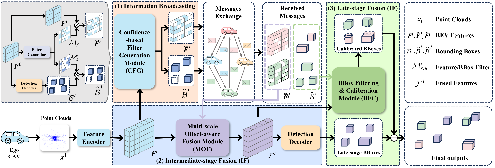

# mmCooper
The official implementation of ICCV 2025 paper "mmCooper: A Multi-agent Multi-stage Communication-efficient and Collaboration-robust Cooperative Perception Framework".



## Abstract
Collaborative perception significantly enhances individual vehicle perception performance through the exchange of sensory information among agents. However, realworld deployment faces challenges due to bandwidth constraints and inevitable calibration errors during information exchange. To address these issues, we propose mmCooper, a novel multi-agent, multi-stage, communicationefficient, and collaboration-robust cooperative perception framework. Our framework leverages a multi-stage collaboration strategy that dynamically and adaptively balances intermediate- and late-stage information to share among agents, enhancing perceptual performance while maintaining communication efficiency. To support robust collaboration despite potential misalignments and calibration errors, our framework prevents misleading low-confidence sensing information from transmission and refines the received detection results from collaborators to improve accuracy. The extensive evaluation results on both real-world and simulated datasets demonstrate the effectiveness of the mmCooper framework and its components.

## Installation
Please refer to [OpenCOOD](https://opencood.readthedocs.io/en/latest/md_files/installation.html) and [centerformer](https://github.com/TuSimple/centerformer/blob/master/docs/INSTALL.md) for more installation details.

```bash
# Clone the OpenCOOD repo
git clone https://github.com/DerrickXuNu/OpenCOOD.git
cd OpenCOOD

# Create a conda environment
conda env create -f environment.yml
conda activate opencood

# install pytorch
conda install -y pytorch torchvision cudatoolkit=11.3 -c pytorch

# install spconv 
pip install spconv-cu113

# install basic library of deformable attention
git clone https://github.com/TuSimple/centerformer.git
cd centerformer

# install requirements
pip install -r requirements.txt
sh setup.sh

# clone our repo
https://github.com/tengjjj/mmCooper.git

# install mmCooper into the conda environment
python setup.py develop
python multistage/utils/setup.py build_ext --inplace
```

## Data
Please download the [OPV2V](https://drive.google.com/drive/folders/1dkDeHlwOVbmgXcDazZvO6TFEZ6V_7WUu) datasets. The dataset folder should be structured as follows:
```sh
opv2v # the downloaded opv2v data
  ── train
  ── validate
  ── test
```

## Getting Started
### Test with pretrained model
We provide our pretrained models on OPV2V datasets. The download URLs are as follows:

* Google Drive URL is [here](https://drive.google.com/drive/folders/1_8M0Duv9Z76ZdWSaLS7YJQVyiuQJHDrF?usp=sharing).


To test the provided pretrained models of mmCooper, please download the model file and put it under multistage/logs/. The `validate_path` in the corresponding `config.yaml` file should be changed as `opv2v/test`. Also, you need to change the `model_dir` parameter in `inference.py` to your own path.

Run the following command to conduct test:
```sh
python multistage/tools/inference.py
```

### Train your model
We follow OpenCOOD to use yaml files to configure the training parameters. You can use the following command to train your own model from scratch or a continued checkpoint:
```sh
CUDA_LAUNCH_BLOCKING=1 CUDA_VISIBLE_DEVICES=1 python multistage/tools/train.py --hypes_yaml ${YAML_DIR} --model_dir {}
```
The explanation of the optional arguments are as follows:
- `hypes_yaml`: the path of the training configuration file, e.g. `multistage/hypes_yaml/multistage_opv2v.yaml`. You can change the configuration parameters in this provided yaml file.
- `model_dir` (optional) : the path of the checkpoints. This is used to fine-tune the trained models. When the `model_dir` is
given, the trainer will discard the `hypes_yaml` and load the `config.yaml` in the checkpoint folder.

## Citation
 If you are using our mmCooper for your research, please cite the following paper:
 ```bibtex
@article{liu2025mmcooper,
  title={mmCooper: A Multi-agent Multi-stage Communication-efficient and Collaboration-robust Cooperative Perception Framework},
  author={Liu, Bingyi and Teng, Jian and Xue, Hongfei and Wang, Enshu and Zhu, Chuanhui and Wang, Pu and Wu, Libing},
  journal={arXiv preprint arXiv:2501.12263},
  year={2025}
}
```

## Acknowledgement
Many thanks to Runsheng Xu for the high-quality dataset and codebase, including [OPV2V](https://drive.google.com/drive/folders/1dkDeHlwOVbmgXcDazZvO6TFEZ6V_7WUu), [OpenCOOD](https://github.com/DerrickXuNu/OpenCOOD) and [OpenCDA](https://github.com/ucla-mobility/OpenCDA). The same goes for [Where2comm](https://github.com/MediaBrain-SJTU/Where2comm.git) and [centerformer](https://github.com/TuSimple/centerformer.git) for the excellent codebase.